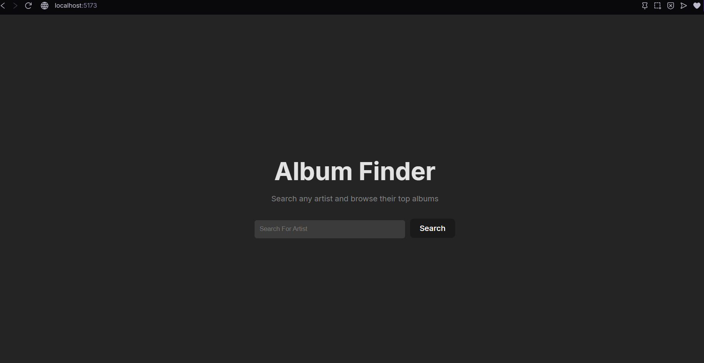
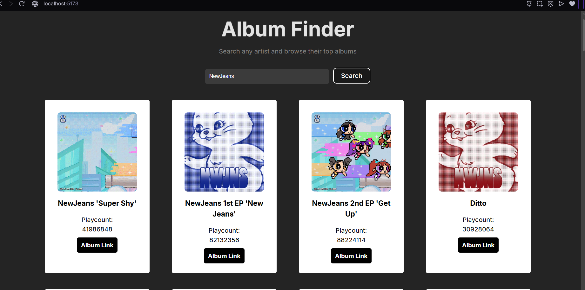

Album Finder 
-An app that lets you search and browse for an artist and their top albums, complete with their cover album and listening count which powered by Last.fm API.

The Reason Behind Using Last.fm API instead of Spotify
-Recently, Spotify ruled out that only premium account can get access to their web API. To solve that, I decided to use Last.fm API as the alternative since its free to use.

Features
-Search any artist by name
-View their top albums with cover art
-See play counts for each album
-Click through album Last.fm's page for more information

Tech stack 
-React Bootstrap
-Javascript
-CSS
-Vite

Screenshots

Gettin started
1.Clone the Repo
-git clone https://github.com/arieztech/album-finder.git
-cd album-finder

2.Install dependencies
-npm install

3.Get Last.fm API Key
-Create account at Last.fm
-Go to last.fm/api/account/create to register an app and get an API key
-Callback URL can be anything (e.g. http://localhost:5173/) since this project doesn't use Last.fm's user auth flow

4.Set up environment variables
-create .env file in the project root : 
 VITE_CLIENT_ID=your_lastfm_api_key_here

5.Run it
-npm run dev
-Then open the local URL 

[Live Demo](https://album-finder-arieztech.vercel.app)

Things that I've learned
-Adapting when theres a change during mid-build when a third party app's API requirements changed.
-Mapping UI to a completely different API response shape (Last.fm vs. Spotify)
-Handling missing/inconsistent data from a public API (e.g. albums without cover art)

